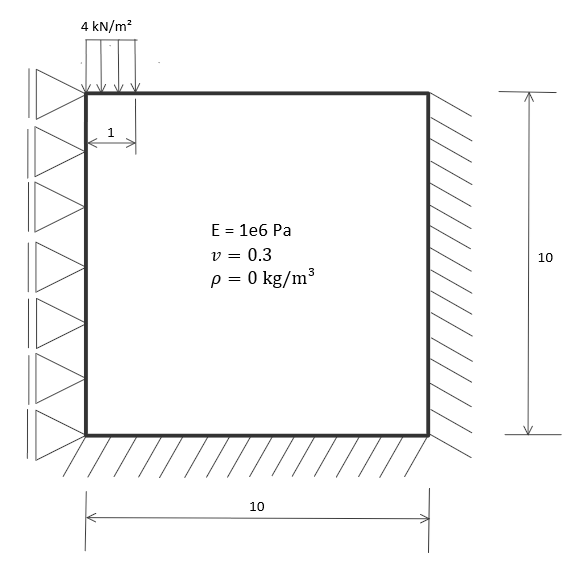
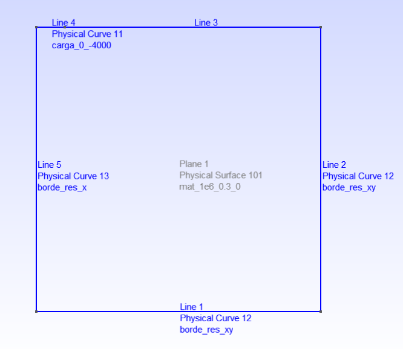
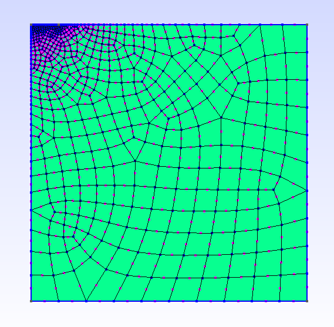
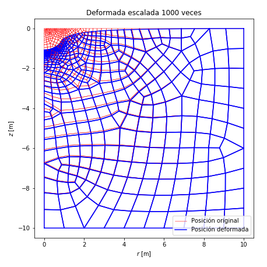

# Modificación de un programa de análisis por MEF para el caso axisimétrico, usando elementos finítos serendípitos de 8 nodos.

## Objetivo: 
Modificar el programa dado [ejemplo_Q8_axisimetrico_original.py](ejemplo_Q8_axisimetrico_original.py) (por: Diego A. Álvarez) de tal manera los datos de entrada puedan ser leídos directamente desde una malla creada en GMSH, haciendo uso de los grupos físicos.

El programa con todas las modificaciones respectivas es el siguiente: [ejemplo_Q8_axisimetrico_modificado.py](ejemplo_Q8_axisimetrico_modificado.py).

## Descripción de modificaciones realizadas:

### Lectura de propiedades de material
Cada superficie distinta creada en GMSH corresponderá en esencia a un "material diferente", incluso si sus propiedades fuesen iguales, ya que GMSH reportará los elementos finitos como pertenecientes a una entidad distinta.
Para cada superficie se debe asignar un grupo físico con la sintaxis *mat_E_nu_rho*, por ejemplo: Si se trata de un material con **E = 2e8 Pa**, **nu = 0.3** y **rho = 2400 kg/m³**, la superficie física asociada debería llamarse *mat_1e8_0.3_2400*, el programa leerá los números entre guiones bajos en ese orden, siempre y cuando estén escritos de tal modo que Python los pueda convertir a flotantes.

**Importante:** Al crear la malla, las etiquetas grupos físicos asociados a cada superficie deben tener el mismo orden que las etiquetas de las superficies respectivas, pues GMSH reporta tanto grupos físicos como entidades en orden creciente de etiquetas.

### Lectura de condiciones de frontera:

Las condiciones de frontera se pueden aplicar sobre puntos físicos o sobre curvas físicas. Para el caso de los puntos con ciertas condiciones de apoyo, el grupo físico se debe crear, según el tipo de restricción, así:

-  **Punto con desplazamiento restringido en x, y**: Sintaxis nombre del grupo físico: *punto_res_xy*
-  **Punto con desplazamiento restringido en x**: Sintaxis nombre del grupo físico: *punto_res_x*
-  **Punto con desplazamiento restringido en y**: Sintaxis nombre del grupo físico: *punto_res_y*

Para el caso de bordes con condiciones de apoyo aplicadas, los grupos físicos se manejan de manera similar al caso anterior, en este caso:
-  **Borde con desplazamiento restringido en x, y (empotrado)**: Sintaxis nombre del grupo físico: *borde_res_xy*
-  **Borde con desplazamiento restringido en x**: Sintaxis nombre del grupo físico: *borde_res_x*
-  **Borde con desplazamiento restringido en y**: Sintaxis nombre del grupo físico: *borde_res_y*

### Lectura de cargas puntuales:

Las cargas puntales se deben reportar en grupos físicos de dimensión 0, es decir puntos físicos. Estos deben llevar un nombre con la siguiente sintaxis: *puntual_Px_Py*, esto implica que en el punto (o puntos) pertenecientes a este grupo físico se quiere aplicar una fuerza puntual de componentes ortogonales **Px** y **Py** (con su respectivo signo).

### Lectura de cargas distribuidas sobre un borde:

Las cargas distribuidas (fuerzas superficiales) se reportan sobre curvas físicas. En este caso se tiene una restricción y es que bajo estas condiciones el programa solo permite leer cargas distribuidas de magnitud y dirección uniformes sobre la curva en cuestión. En este caso, una carga distribuida de componentes **fx** y **fy** (lo cual implica que la carga puede tener alguna inclinación) corresponderá a la siguiente sintaxis en el nombre del grupo físico: *carga_fx_fy* (con su respectivo signo).

## Ejemplo del uso del programa:

Se resolvió por el MEF el siguiente problema axisimétrico: 

Para modelar este problema se creó la siguiente malla (nótese los nombres de los grupos físicos para indicar restricciones y/o cargas). Esta malla se creó utilizando la API de GMSH para Python por medio del código [malla_boussinesq](malla_boussinesq.py).

Finalmente tras correr el análisis se obtuvo la siguiente deformada (escalada 1000 veces). Los demás resultados se pueden constatar al ejecutar el [código respectivo](ejemplo_Q8_axisimetrico_modificado.py).

 
